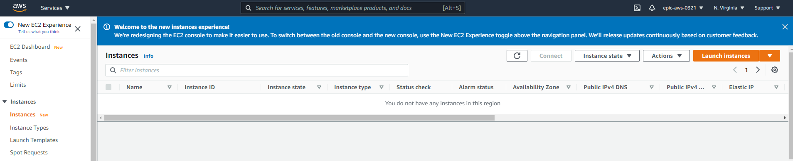
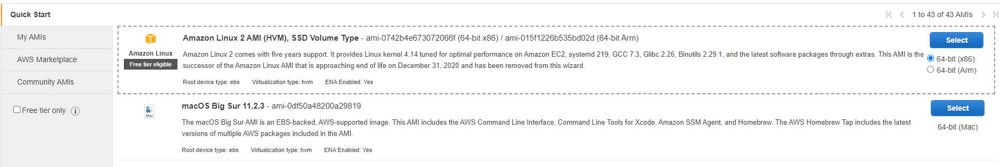
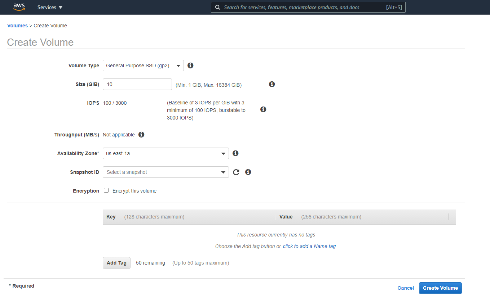
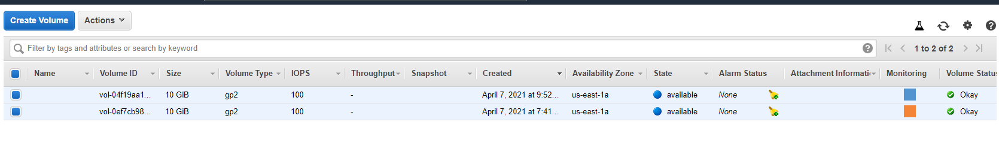

# Lab 03 - Creating EBS Volume and attaching it to EC2

In this lab you will learn how to create AWS EBS device and attach to instance during creation time and after EC2 creation. For this lab to work, set your region to “us-east-1”

### Objective 

- Create EC2 instance with EBS volume 
- Mount and Format the EBS device
- Create 2nd EBS volume
- Attach the EBS to existing instance
- Mount and Format the 2nd EBS device
- Attach the share
- Run simulation for data change

#### 1. Create EC2 with EBS Device

- From AWS console, search for EC2 in search menu
  


- Click "Launch instance" 
- Select AMI "Amazon Linux 2 AMI (HVM), SSD Volume Type - ami-0742b4e673072066f (64-bit x86)"


- Select t2.micro shape
- Verify the instance properties & select the default VPC
- Select "Add storage" and add 10GiB EBS volume


- Select Review and Launch 
- Provide your existing key-pair and wait for instance to boot up


#### 2. Verify and Mount device

- Connect to newly created EC2 
- Verify the EBS device is visible to EC2

```
lsblk
```


- Partition and mount the device 

```
sudo lsblk -f
sudo mkfs -t xfs /dev/xvdb
sudo yum install xfsprogs
sudo mkdir /data
sudo mount /dev/xvdb /data
```

- Verify that /data is writeable 
```
time for i in {1..10}; 
do
sudo touch /data/datafile.$i;
done;
```


#### 3. Create EBS device and attach to instance

- Under EC2 dashboard, select "Volumes"
- Select/Click create volume button
- Provide following values below:
  - Volume Type: GP2 
  - Size: 10GiB
  - Availability Zone: Same as EC2 instance (us-east-1a)



- Create Volume & wait for volume to provision
- Volume will be in available state


- Select the volume and select "Actions" --> Attach Volume 


- As you notice, available instance in same zone are visible - Select and Attach.


- Verify that device is visible from EC2 instance 


#### 4. Partition and Mount

- Partition and mount the device /dev/xvd*

```
sudo lsblk -f
sudo mkfs -t xfs /dev/xvdf
sudo yum install xfsprogs
sudo mkdir /backup
sudo mount /dev/xvdf /backup
```


- Verify that /backup is writeable 

```
sudo tar -zcvf /backup/data_backup.tar.gz /data/*
```


### Clean Up

- Terminate the EC2 instance
- From EC2 console, select your instance you created – right click and select "Terminate instance"


- Select the Volumes section from EC2 console page
- Select the volumes to be deleted 



- Under Actions, delete volumes & confirm 


### Conclusion 

What did we learn? With AWS EBS devices we can create attach data disk with EC2 instances and volumes can be attached at the creation time or after the fact.

