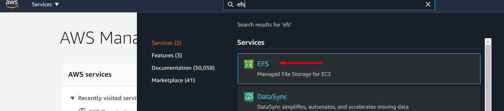
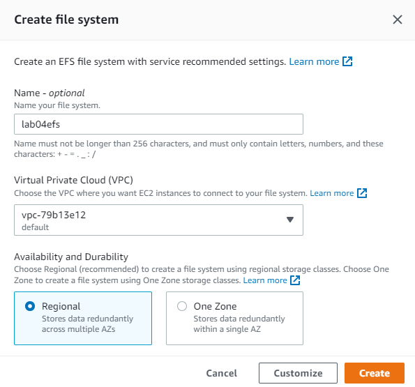
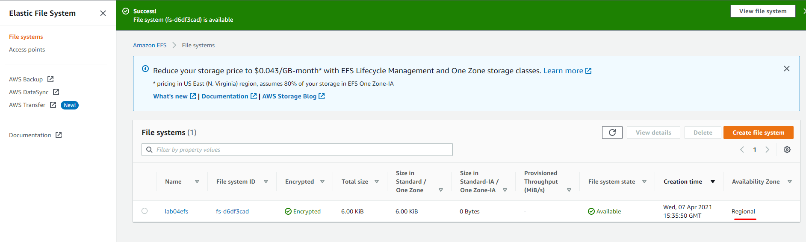
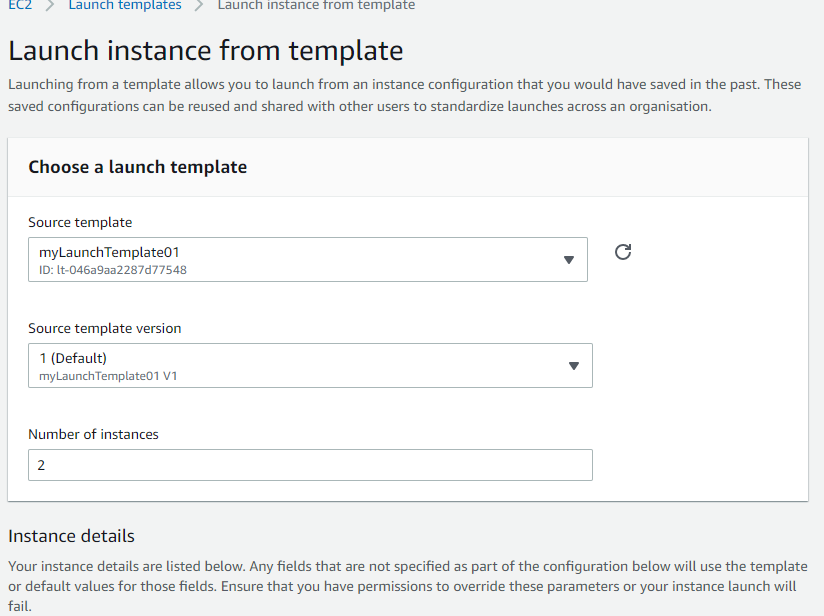
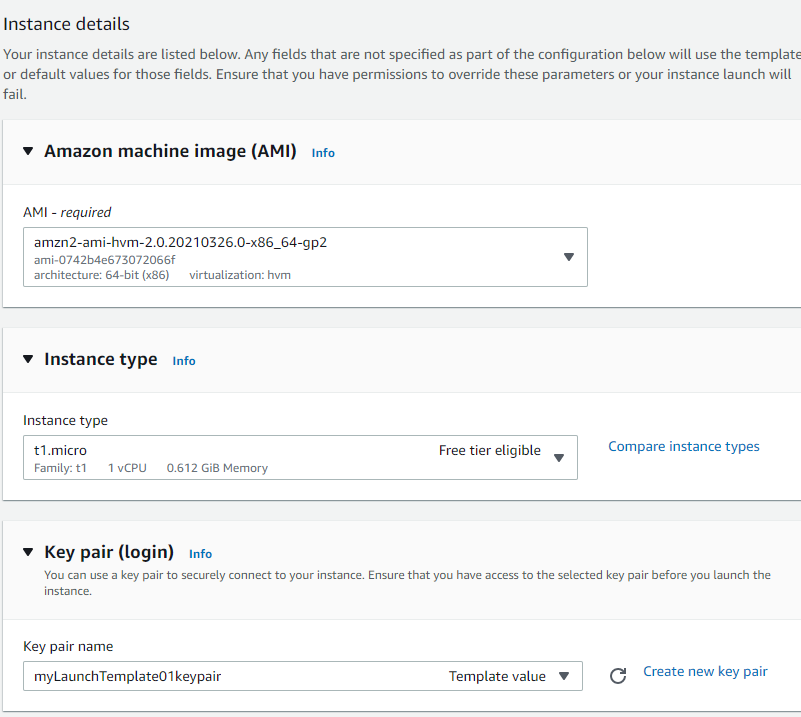
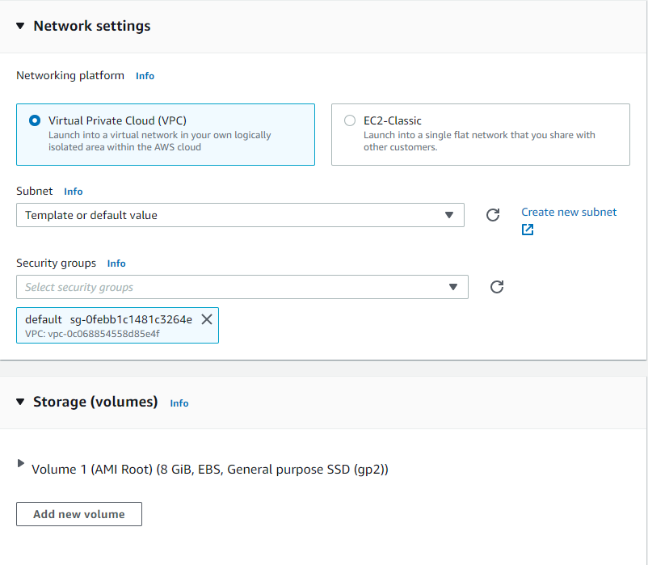
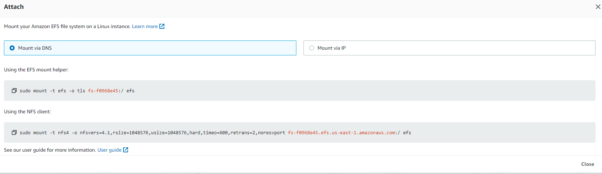
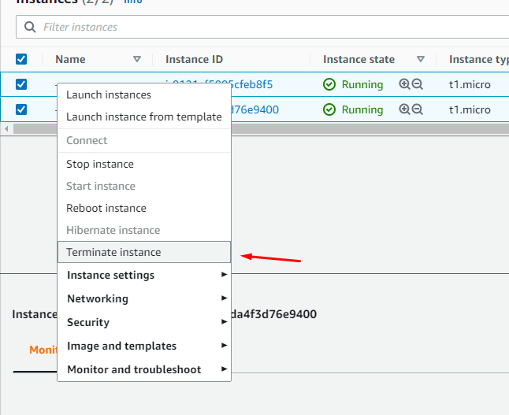

# Lab 04 - Creating EFS filesystem with two EC2 instances

In this lab you will learn how to create AWS EFS filesystem and attach share with two EC2 instances. For this lab to work, set your region to “us-east-1”

### Objective 

- Create EFS filesystem 
- Create EC2 instances with launch template
- Install required packages for NFS
- Create EFS mounts 
- Attach the share
- Run simulation for data change

#### 1. Create EFS Volume

- From AWS console, search for EFS in search menu
  


- Select "Create file system" 
- 
- Supply the following properties
  - Name = lab04nfs
  - VPC = default VPC 
  - Availability and Durability = Regional




- Once the EFS service is created, let's create NFS share
- View "lab04nfs"




#### 2. Launch EC2 from template

- From AWS console, search for EC2 in search menu
- Select "Launch Template"
- Under Action "Launch instance from template"
- Under instance number, change to "2" 





- Launch instance from template

#### 3. Attach EFS with EC2 instances

- Install the efs packages on both EC2 instances
```
sudo mkdir /efs
sudo yum -y install amazon-efs-utils
```
- Find the mount command from EFS landing


- Click the "Attach" button
```
sudo mount -t efs -o tls fs-f0xxxxx:/ /efs
```
- After the successful mount should look like below:

```
[ec2-user@ip-172-31-1-8 ~]$ df -h
Filesystem      Size  Used Avail Use% Mounted on
devtmpfs        280M     0  280M   0% /dev
tmpfs           291M     0  291M   0% /dev/shm
tmpfs           291M  504K  290M   1% /run
tmpfs           291M     0  291M   0% /sys/fs/cgroup
/dev/xvda1      8.0G  1.5G  6.6G  18% /
tmpfs            59M     0   59M   0% /run/user/1000
127.0.0.1:/     8.0E     0  8.0E   0% /efs
[ec2-user@ip-172-31-1-8 ~]$ 
```

- Repeat the mount on instance # 2 
  
```
sudo mkdir /efs
sudo yum -y install amazon-efs-utils
sudo mount -t efs -o tls fs-f0xxxxx:/ /efs
```

#### 4 - Run simulation

- Execute script below from one of the EC2 instance:
  
```
time for i in {1..1024}; do
  sudo touch /efs/deleteme.$i;
  done;
```

- From instance # 2 validate the files created
- Can you see the files?


### Clean Up

- Terminate the EC2 instances 
- From EC2 console, select your instance you created – right click and select "Terminate instance"




- From console search for EFS,  select the filesystem, click "Delete" and provide the fs name "fs-xxxxxx"
  
### Conclusion 

What did we learn? With AWS EFS we can create NFS share and advertise it multiple EC2 instances and also we can write data in parallel from multiple sources.

Also we can create backup for appservers, application needing shared mounts and caching.
