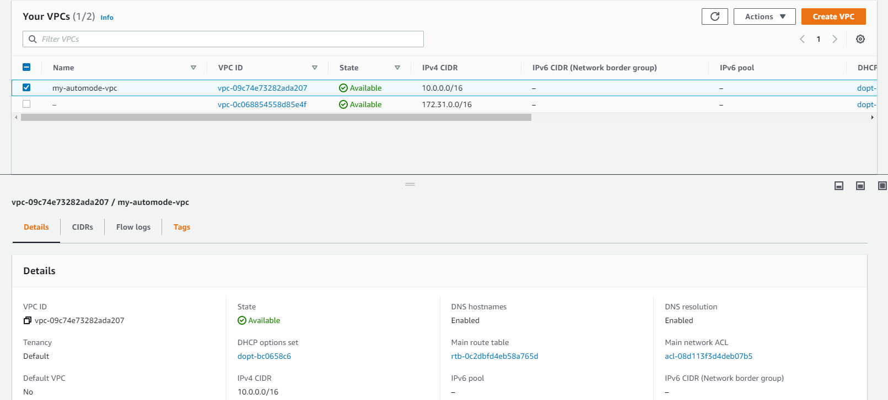
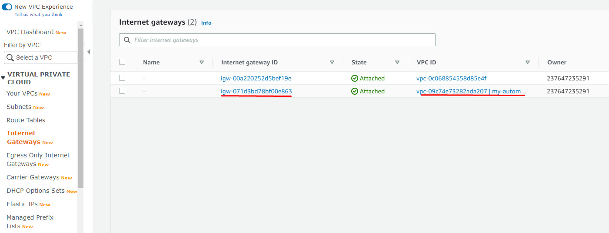
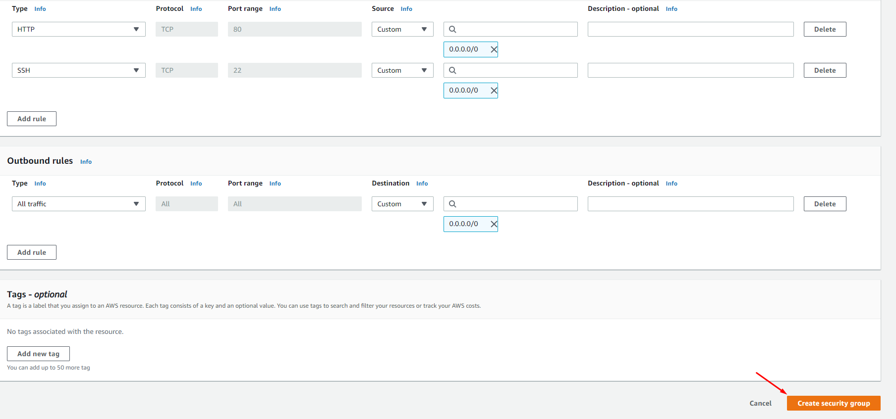
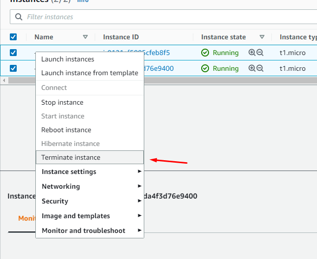

# Lab 01 - Create VPC 

In this lab you will learn how to create VPC with auto mode method
- VPC with launch wizard (Only for sandbox and testing)

For this lab to work, you will need IAM admin access or policy to allow
creation of VPC or network operator job role.

This lab is written to work with region us-east-1

***Note: Auto-mode VPC creates NAT gateway and you may see small
charge for it.***

### Objective 

- Create VPC with auto-mode
- Create EC2 instance within VPC
- Clean-Up 
- 
#### 1. Create VPC with Auto-Mode

- Login to AWS console and in find services search for "VPC"
- From VPC Dashboard, click the "Launch VPC Wizard" - "Select"
  


-  Input values below in table:

| Key                       | Value                 |
| ------------------------- | --------------------- |
| IPv4 CIDR block:          | 10.1.0.0/16           |
| VPC name:                 | my-automode-vpc       |
| Public subnet's IPv4 CIDR | 10.1.0.0/24           |
| Availability Zone         | us-east-1a            |
| Subnet name               | public-sub-us-east-1a |


- Create VPC - This will create VPC with all required resources i.e. VPC, Subnet, RT, IGW, SG

- Locate your new vpc and look for VPC-ID
  


- In the top left menu pane, filter it by VPC-ID
  


- Verify public subnet and view the route-table association by selecting subnet.


- Right click on the subnet and select modify auto-assign IP setting


- Enable auto-assign public IPV4 address & save


- Verify the subnet RT table 


- Verify the Route-Tables – there should be two rt-tables created for you


- Validate information for the internet-gateway and verify if it is attached.



- Verify the default Security-Group and review inbound/outbound rules


- Create a new Security-Group and name it "access-security-group" by clicking "Create Security group"
  - Provide the input value
    - Security group name: access-security-group
    - Description: SG for access-security-group
    - VPC: This the VPC that was created in above steps
    - Add Rule # 1: HTTP with 0.0.0.0/0
    - Add Rule # 2: SSH with 0.0.0.0/0

- Leave the outbound rule as default and create security group
  


  

#### 2. Launch EC2 with new VPC 

- From AWS console, search for EC2 in search menu
- Launch instance 
- Select AMI "Amazon Linux 2 AMI (HVM), SSD Volume Type - ami-0742b4e673072066f (64-bit x86)" 


- Select the shape t2.micro - Next to Network
- Select the VPC "my-autocreate-vpc" create 


- Scroll to the bottom - Under the "user data" - copy & paste bootstrap commands:

```
#!/bin/bash
yum update -y amazon-linux-extras install -y lamp-mariadb10.2-php7.2 php7.2
yum install -y httpd mariadb-server
systemctl start httpd
systemctl enable httpd
usermod -a -G apache ec2-user
chown -R ec2-user:apache /var/www
chmod 2775 /var/www
find /var/www -type d -exec chmod 2775 {} \;
find /var/www -type f -exec chmod 0664 {} \;
echo "<?php phpinfo(); ?>" > /var/www/html/phpinfo.php
```

- Continue till security group selection & select the SG that was created in step above


- Review & launch and select the key-pair

- Once the instance is up, take the public IP & paste in browser - Apache webpage should be visible.


### Clean Up

- Terminate the EC2 instances 
- From EC2 console, select your instance you created – right click and select "Terminate instance"




- From console search for VPC,  select the VPC that was created under "Your VPC"
- Under Actions "Delete VPC" and provide the fs name "fs-xxxxxx"


### Conclusion 

You learned how to create VPC with auto-mode, change IPv4 setting for subnet and created Security group. Also, you learned how launch EC2 with custom VPC vs default.