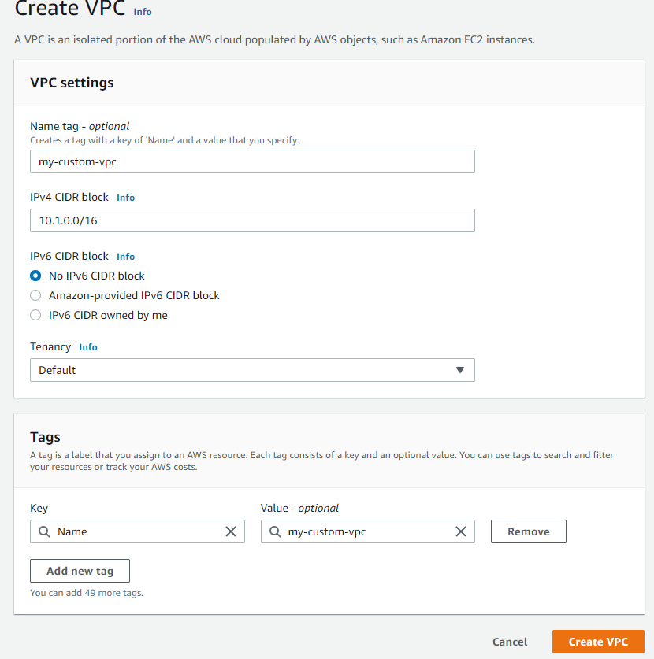

# Lab 01 - Create VPC 

In this lab you will learn how to create VPC with custom mode method
- VPC with this method is common method for controlling resources and network topology.

For this lab to work, you will need IAM admin access or policy to allow
creation of VPC or network operator job role.

This lab is written to work with region us-east-1


### Objective 

- Create VPC with custom-mode
- Create EC2 instance within VPC
- Clean-Up 

### 1. Create VPC with Custom-Mode

- Login to AWS console and in find services search for "VPC"
- From VPC Dashboard, select "You VPCs" click the "Create" 
  

-  Input values below in table:

| Key                       | Value                 |
| ------------------------- | --------------------- |
| IPv4 CIDR block:          | 10.1.0.0/16           |
| VPC name:                 | my-custom-vpc         |
| Public subnet's IPv4 CIDR | 10.1.0.0/24           |
| Availability Zone         | us-east-1a            |
| Subnet name               | public-sub-us-east-1a |



This will create empty VPC with no subnets or other resources, but will have main RT table.

- Select Subnets from left pane and filter by VPC "my-custom-vpc"
- We will create four subnets - two public and two private

| Key                   | Value                  |
| --------------------- | ---------------------- |
| Public Subnet name 1  | pub-subnet-us-east-1a  |
| Public subnet-1 CIDR  | 10.1.1.0/28            |
| Availability Zone     | us-east-1a             |
| Public Subnet name 2  | pub-subnet-us-east-1b  |
| Public subnet-2 CIDR  | 10.1.2.0/28            |
| Availability Zone     | us-east-1b             |
| Private Subnet name 1 | priv-subnet-us-east-1a |
| Private subnet-1 CIDR | 10.1.11.0/26           |
| Availability Zone     | us-east-1a             |
| Private Subnet name 2 | priv-subnet-us-east-1b |
| Private subnet-2 CIDR | 10.1.12.0/26           |
| Availability Zone     | us-east-1b             |

- Click "Create subnet"
- Select "my-custom-vpc"
- Populate the subnets attributes with information in table
 


- Create the subnet 
- Repeat the steps for reset of the three subnets(careful with CIDR range)
  


- Verify one of the public subnet and view the route-table association by selecting subnet.


- What do you noticed? none of the subnets are associated with route table..
- Firstly, Let's create IGW (internet gateway) and attach it to VPC
  - On left pane, select Internet Gateway
  - Click Create Internet Gateway
  - 
  - Under Actions -> Attach to VPC -> select the VPC "my-custom-vpc" 
  - 

- Now, let's create RT tables for Public subnet
  - From VPC dashboard -> select Route Tables -> Create route table 
  - Tag the name "rt-public-main"
  - Select the my-custom-vpc
  - Create
  - 

- Associate public subnets to "rt-public-main" 
  - Under the "Subnet Association" -> select "edit subnet associations" 
  


  - Select the public subnets 
  


- Set the next hop for the route to IGW
  - Under the routes tab -> Edit routes -> 
  


- Verify the default Security-Group and review inbound/outbound rules


- Create a new Security-Group and name it "access-security-group" by clicking "Create Security group"
  - Provide the input value
    - Security group name: access-security-group
    - Description: SG for access-security-group
    - VPC: This the VPC that was created in above steps
    - Add Rule # 1: HTTP with 0.0.0.0/0
    - Add Rule # 2: SSH with 0.0.0.0/0

- Leave the outbound rule as default and create security group
  


  


### 2. Launch EC2 with new VPC 

- From AWS console, search for EC2 in search menu
- Launch instance 
- Select AMI "Amazon Linux 2 AMI (HVM), SSD Volume Type - ami-0742b4e673072066f (64-bit x86)" 


- Select the shape t2.micro - Next to Network
- Select the VPC "my-custom-vpc"  


- Scroll to the bottom - Under the "user data" - copy & paste bootstrap commands:

```
#!/bin/bash
yum update -y amazon-linux-extras install -y lamp-mariadb10.2-php7.2 php7.2
yum install -y httpd mariadb-server
systemctl start httpd
systemctl enable httpd
usermod -a -G apache ec2-user
chown -R ec2-user:apache /var/www
chmod 2775 /var/www
find /var/www -type d -exec chmod 2775 {} \;
find /var/www -type f -exec chmod 0664 {} \;
echo "<?php phpinfo(); ?>" > /var/www/html/phpinfo.php
```

- Continue till security group selection & select the SG that was created in step above


- Review & launch and select the key-pair

- Once the instance is up, take the public IP & paste in browser - Apache webpage should be visible.


### 3. Create backend workloads

So far we have been creating application for internet facing workload, however in most cases that is typically not the use case. 

As part of our VPC creation we also created private subnets. Now's lets try to setup & access workload on private instance.


- From AWS console and in find services search for "VPC"
- From VPC Dashboard, select "Route Tables" 
- Click "Create route table"
  - Name tag: rt-private-access
  - VPC: my-custom-vpc


- Select the route table "rt-private-access"
  - Under Subnet Associations  -> Edit subnet associations
  - Select both private subnets
  


- Create a new Security-Group and name it "private-access-security-group" by clicking "Create Security group"
  - Provide the input value
    - Security group name: private-access-security-group
    - Description: SG for private-access-security-group
    - VPC: This the VPC that was created in above steps
    - Add Rule # 1: All Traffic with from access-security-group

- Leave the outbound rule as default and create security group
  

  
#### Create EC2 in private subnet

- From AWS console, search for EC2 in search menu
- Launch instance 
- Select AMI "Amazon Linux 2 AMI (HVM), SSD Volume Type - ami-0742b4e673072066f (64-bit x86)" 


- Select the shape t2.micro - Next to Network
- Select the VPC "my-custom-vpc" lab2-15-vpc.png 


- Scroll to the bottom - Under the "user data" - copy & paste bootstrap commands:

```
#!/bin/bash
yum update -y amazon-linux-extras install -y lamp-mariadb10.2-php7.2 php7.2
yum install -y httpd mariadb-server
systemctl start httpd
systemctl enable httpd
usermod -a -G apache ec2-user
chown -R ec2-user:apache /var/www
chmod 2775 /var/www
find /var/www -type d -exec chmod 2775 {} \;
find /var/www -type f -exec chmod 0664 {} \;
echo "<?php phpinfo(); ?>" > /var/www/html/phpinfo.php
```

- Continue till security group selection & select the SG (private-access-security-group) that was created in step above


- Review & launch and select the key-pair

- Once the instance is up, access the Apache webpage should be visible.

- What is happening? Can you access the webpage? 

- Try to access the instance via SSH from instance with public IP


### Clean Up

- Terminate the EC2 instances 
- From EC2 console, select your instance you created – right click and select "Terminate instance"


- From console search for VPC,  select the VPC that was created under "Your VPC"
- Under Actions "Delete VPC" and provide the fs name "fs-xxxxxx"


### Conclusion 

You learned how to create VPC with custom-mode, created multiple subnets and created multiple security group. Also, you learned how launch EC2 with custom VPC with different tiers.