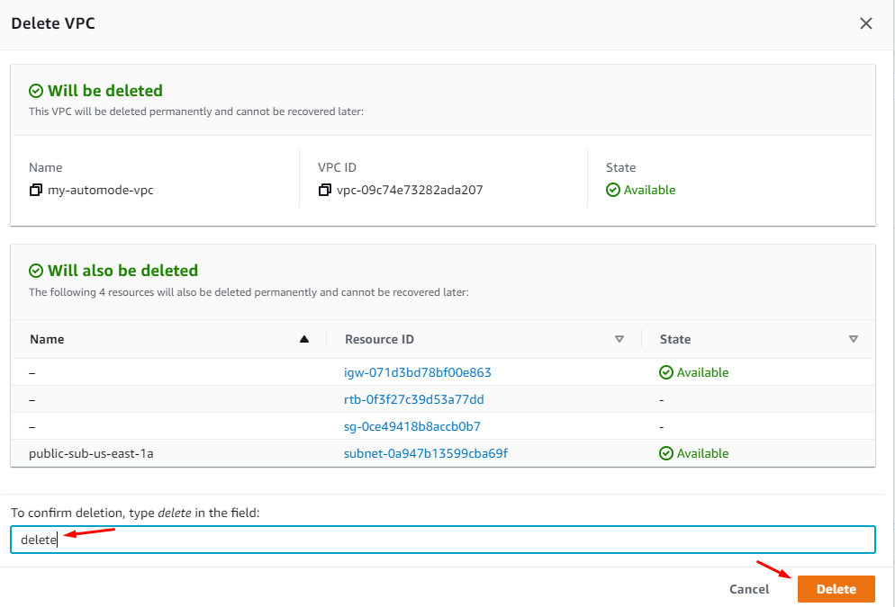

# Lab 03 - Create VPC 

In this lab you will learn how to create 3 VPC and peer them using peering link. For this lab we will leverage AWS cli via cloud shell to create our VPC's.

For this lab to work, you will need IAM admin access or policy to allow
creation of VPC or network operator job role.

This lab is written to work with region us-east-1


### Objective 

- Create 3 VPCs with custom-mode
- Clean-Up 

#### 1. Setup cloud shell

- From AWS console select cloudshell 
- Cloudshell is required for the entire lab


#### 2. Create First VPC

- Create 1 VPC with following attributes: 


-  Input values below in table:

| Key                | Value          |
| ------------------ | -------------- |
| IPv4 CIDR block:   | 10.1.0.0/16    |
| Subnet's IPv4 CIDR | 10.1.0.0/24    |
| Availability Zone  | us-east-1a     |
| Public Subnet name | sub-us-east-1a |


```
AWS_VPC_ID=$(aws ec2 create-vpc --cidr-block 10.1.0.0/16 \
--query 'Vpc.{VpcId:VpcId}' \
--output text)

```

- Create subnet for VPC for VPC

```
AWS_SUBNET_PUBLIC_ID=$(aws ec2 create-subnet \
--vpc-id $AWS_VPC_ID --cidr-block 10.1.0.0/24  \
--availability-zone us-east-1a --query 'Subnet.{SubnetId:SubnetId}' \
--output text)

aws ec2 modify-subnet-attribute \
--subnet-id $AWS_SUBNET_PUBLIC_ID \
--map-public-ip-on-launch
```

- Create IGW for the VPC 1 

```
AWS_INTERNET_GATEWAY_ID=$(aws ec2 create-internet-gateway \
--query 'InternetGateway.{InternetGatewayId:InternetGatewayId}' \
--output text)
```

- Attach IGW to VPC 

```
aws ec2 attach-internet-gateway \
--vpc-id $AWS_VPC_ID \
--internet-gateway-id $AWS_INTERNET_GATEWAY_ID
```

- Create the route table 

```
AWS_CUSTOM_ROUTE_TABLE_ID=$(aws ec2 create-route-table \
--vpc-id $AWS_VPC_ID \
--query 'RouteTable.{RouteTableId:RouteTableId}' \
--output text )
```

- Associate the RT table with IGW 

```
aws ec2 create-route \
--route-table-id $AWS_CUSTOM_ROUTE_TABLE_ID \
--destination-cidr-block 0.0.0.0/0 \
--gateway-id $AWS_INTERNET_GATEWAY_ID
```
  
- Associate the subnet with route table, making it a public subnet.


```
AWS_ROUTE_TABLE_ASSOID=$(aws ec2 associate-route-table  \
--subnet-id $AWS_SUBNET_PUBLIC_ID \
--route-table-id $AWS_CUSTOM_ROUTE_TABLE_ID \
--output text)
```

- Create Security group for the VPC access 

```
aws ec2 create-security-group \
--vpc-id $AWS_VPC_ID \
--group-name peering-vpc1-security-group \
--description 'peering VPC1 SG'
```

- Extract the SG ID 

```
AWS_DEFAULT_SECURITY_GROUP_ID=$(aws ec2 describe-security-groups \
--filters "Name=vpc-id,Values=$AWS_VPC_ID" \
--query 'SecurityGroups[?GroupName == `default`].GroupId' \
--output text) &&
AWS_CUSTOM_SECURITY_GROUP_ID=$(aws ec2 describe-security-groups \
--filters "Name=vpc-id,Values=$AWS_VPC_ID" \
--query 'SecurityGroups[?GroupName == `peering-vpc1-security-group`].GroupId' \
--output text)
```

- Create the inbound rules

```
aws ec2 authorize-security-group-ingress \
--group-id $AWS_CUSTOM_SECURITY_GROUP_ID \
--ip-permissions '[{"IpProtocol": "tcp", "FromPort": 22, "ToPort": 22, "IpRanges": [{"CidrIp": "0.0.0.0/0", "Description": "Allow SSH"}]}]' 

aws ec2 authorize-security-group-ingress \
--group-id $AWS_CUSTOM_SECURITY_GROUP_ID \
--ip-permissions '[{"IpProtocol": "tcp", "FromPort": 80, "ToPort": 80, "IpRanges": [{"CidrIp": "0.0.0.0/0", "Description": "Allow HTTP"}]}]'
```


#### 3. Create First VPC

- Create 2 VPC with following attributes: 


-  Input values below in table:

| Key                | Value          |
| ------------------ | -------------- |
| IPv4 CIDR block:   | 10.2.0.0/16    |
| Subnet's IPv4 CIDR | 10.2.0.0/24    |
| Availability Zone  | us-east-1a     |
| Public Subnet name | sub-us-east-1a |


```
AWS_VPC_ID=$(aws ec2 create-vpc --cidr-block 10.2.0.0/16 \
--query 'Vpc.{VpcId:VpcId}' \
--output text)

```

- Create subnet for VPC for VPC

```
AWS_SUBNET_PUBLIC_ID=$(aws ec2 create-subnet \
--vpc-id $AWS_VPC_ID --cidr-block 10.2.0.0/24  \
--availability-zone us-east-1a --query 'Subnet.{SubnetId:SubnetId}' \
--output text)

aws ec2 modify-subnet-attribute \
--subnet-id $AWS_SUBNET_PUBLIC_ID \
--map-public-ip-on-launch
```

- Create IGW for the VPC 2 

```
AWS_INTERNET_GATEWAY_ID=$(aws ec2 create-internet-gateway \
--query 'InternetGateway.{InternetGatewayId:InternetGatewayId}' \
--output text)
```

- Attach IGW to VPC 

```
aws ec2 attach-internet-gateway \
--vpc-id $AWS_VPC_ID \
--internet-gateway-id $AWS_INTERNET_GATEWAY_ID
```

- Create the route table 

```
AWS_CUSTOM_ROUTE_TABLE_ID=$(aws ec2 create-route-table \
--vpc-id $AWS_VPC_ID \
--query 'RouteTable.{RouteTableId:RouteTableId}' \
--output text )
```

- Associate the RT table with IGW 

```
aws ec2 create-route \
--route-table-id $AWS_CUSTOM_ROUTE_TABLE_ID \
--destination-cidr-block 0.0.0.0/0 \
--gateway-id $AWS_INTERNET_GATEWAY_ID
```
  
- Associate the subnet with route table, making it a public subnet.


```
AWS_ROUTE_TABLE_ASSOID=$(aws ec2 associate-route-table  \
--subnet-id $AWS_SUBNET_PUBLIC_ID \
--route-table-id $AWS_CUSTOM_ROUTE_TABLE_ID \
--output text)
```

- Create Security group for the VPC access 

```
aws ec2 create-security-group \
--vpc-id $AWS_VPC_ID \
--group-name peering-vpc2-security-group \
--description 'peering VPC2 SG'
```

- Extract the SG ID 

```
AWS_DEFAULT_SECURITY_GROUP_ID=$(aws ec2 describe-security-groups \
--filters "Name=vpc-id,Values=$AWS_VPC_ID" \
--query 'SecurityGroups[?GroupName == `default`].GroupId' \
--output text) &&
AWS_CUSTOM_SECURITY_GROUP_ID=$(aws ec2 describe-security-groups \
--filters "Name=vpc-id,Values=$AWS_VPC_ID" \
--query 'SecurityGroups[?GroupName == `peering-vpc2-security-group`].GroupId' \
--output text)
```

- Create the inbound rules

```
aws ec2 authorize-security-group-ingress \
--group-id $AWS_CUSTOM_SECURITY_GROUP_ID \
--ip-permissions '[{"IpProtocol": "tcp", "FromPort": 22, "ToPort": 22, "IpRanges": [{"CidrIp": "0.0.0.0/0", "Description": "Allow SSH"}]}]' 

aws ec2 authorize-security-group-ingress \
--group-id $AWS_CUSTOM_SECURITY_GROUP_ID \
--ip-permissions '[{"IpProtocol": "tcp", "FromPort": 80, "ToPort": 80, "IpRanges": [{"CidrIp": "0.0.0.0/0", "Description": "Allow HTTP"}]}]'
```

#### 4. Create First VPC

- Create 3 VPC with following attributes: 


-  Input values below in table:

| Key                | Value          |
| ------------------ | -------------- |
| IPv4 CIDR block:   | 192.168.0.0/1    |
| Subnet's IPv4 CIDR | 192.168.1.0/24   |
| Availability Zone  | us-east-1b    |
| Public Subnet name | sub-us-east-1b |


```
AWS_VPC_ID=$(aws ec2 create-vpc --cidr-block 192.168.0.0/16 \
--query 'Vpc.{VpcId:VpcId}' \
--output text)

```

- Create subnet for VPC for VPC

```
AWS_SUBNET_PUBLIC_ID=$(aws ec2 create-subnet \
--vpc-id $AWS_VPC_ID --cidr-block 192.168.1.0/24  \
--availability-zone us-east-1b --query 'Subnet.{SubnetId:SubnetId}' \
--output text)

aws ec2 modify-subnet-attribute \
--subnet-id $AWS_SUBNET_PUBLIC_ID \
--map-public-ip-on-launch
```

- Create IGW for the VPC 2 

```
AWS_INTERNET_GATEWAY_ID=$(aws ec2 create-internet-gateway \
--query 'InternetGateway.{InternetGatewayId:InternetGatewayId}' \
--output text)
```

- Attach IGW to VPC 

```
aws ec2 attach-internet-gateway \
--vpc-id $AWS_VPC_ID \
--internet-gateway-id $AWS_INTERNET_GATEWAY_ID
```

- Create the route table 

```
AWS_CUSTOM_ROUTE_TABLE_ID=$(aws ec2 create-route-table \
--vpc-id $AWS_VPC_ID \
--query 'RouteTable.{RouteTableId:RouteTableId}' \
--output text )
```

- Associate the RT table with IGW 

```
aws ec2 create-route \
--route-table-id $AWS_CUSTOM_ROUTE_TABLE_ID \
--destination-cidr-block 0.0.0.0/0 \
--gateway-id $AWS_INTERNET_GATEWAY_ID
```
  
- Associate the subnet with route table, making it a public subnet.


```
AWS_ROUTE_TABLE_ASSOID=$(aws ec2 associate-route-table  \
--subnet-id $AWS_SUBNET_PUBLIC_ID \
--route-table-id $AWS_CUSTOM_ROUTE_TABLE_ID \
--output text)
```

- Create Security group for the VPC access 

```
aws ec2 create-security-group \
--vpc-id $AWS_VPC_ID \
--group-name peering-vpc3-security-group \
--description 'peering VPC3 SG'
```

- Extract the SG ID 

```
AWS_DEFAULT_SECURITY_GROUP_ID=$(aws ec2 describe-security-groups \
--filters "Name=vpc-id,Values=$AWS_VPC_ID" \
--query 'SecurityGroups[?GroupName == `default`].GroupId' \
--output text) &&
AWS_CUSTOM_SECURITY_GROUP_ID=$(aws ec2 describe-security-groups \
--filters "Name=vpc-id,Values=$AWS_VPC_ID" \
--query 'SecurityGroups[?GroupName == `peering-vpc3-security-group`].GroupId' \
--output text)
```

- Create the inbound rules

```
aws ec2 authorize-security-group-ingress \
--group-id $AWS_CUSTOM_SECURITY_GROUP_ID \
--ip-permissions '[{"IpProtocol": "tcp", "FromPort": 22, "ToPort": 22, "IpRanges": [{"CidrIp": "0.0.0.0/0", "Description": "Allow SSH"}]}]' 

aws ec2 authorize-security-group-ingress \
--group-id $AWS_CUSTOM_SECURITY_GROUP_ID \
--ip-permissions '[{"IpProtocol": "tcp", "FromPort": 80, "ToPort": 80, "IpRanges": [{"CidrIp": "0.0.0.0/0", "Description": "Allow HTTP"}]}]'
```


#### 5. Enable Peering between VPCs

- First get the VPC id's for requestor and acceptor vpc's

```
aws ec2 --output text --query 'Vpcs[*].{VpcId:VpcId,Name:Tags[?Key==`Name`].Value|[0],CidrBlock:CidrBlock}' describe-vpcs
```
- Get the VPC ID for VPC 1 with range 10.1.0.0/16
  - VPC-ID = vpc-05eef96b92738230e
- Get the VPC ID for VPC 2 with range 10.2.0.0/16
  - VPC-ID = vpc-0299a405d88e8fe01

- First peering connection between VPC-1 and VPC-2

```
aws ec2 create-vpc-peering-connection --vpc-id vpc-05eef96b92738230e --peer-vpc-id vpc-0299a405d88e8fe01

```

- From VPC dashboard -> select VPC Peering 
- Do you see peering in "Pending Acceptance"? 

- List the peering connection

```
aws ec2 describe-vpc-peering-connections 
```
- Now accept the request 

```
aws ec2 accept-vpc-peering-connection --vpc-peering-connection-id pcx-0cfc95194c22ddb74
```

- Did the status changed to peered? 

#### 6. Establish the peering with VPC 1 and VPC3 

Challenge - peer connection between VPC 1 and VPC 3 by using the example from above and construct the CLI command or via UI.

### Clean Up

- Delete the peering for VPC to be deleted.

```
aws ec2 describe-vpc-peering-connections 

aws ec2 delete-vpc-peering-connection --vpc-peering-connection-id  pcx-0cfc95194c22ddb74
```

- From console search for VPC,  select the VPC that was created under "Your VPC"
- Under Actions "Delete VPC" 



### Conclusion 

You learned how to create VPC with auto-mode, change IPv4 setting for subnet and created Security group. Also, you learned how launch EC2 with custom VPC vs default.